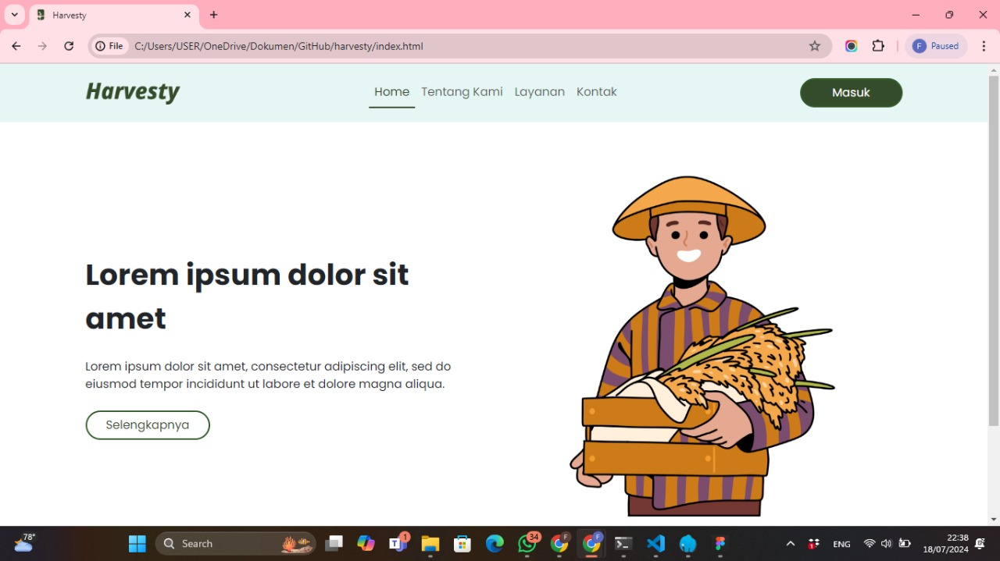
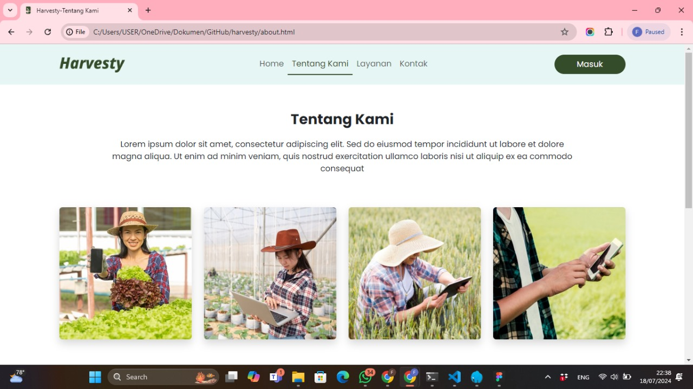

## **Introduction**
Harvesty is a web-based application that aims to improve the agricultural sector in Indonesia by creating agricultural transactions that are transparent and profitable for farmers. This application also aims to attract the interest of the younger generation through a modern approach and providing digital consultation services. Harvesty offers features for marketing agricultural products, consulting with agricultural consultants, accessing agricultural articles and communicating using the chat feature.
The expected output is:
● Digital agricultural transactions
● Education and interest of the younger generation
● Digital Consulting Services

## **Screenshot**

